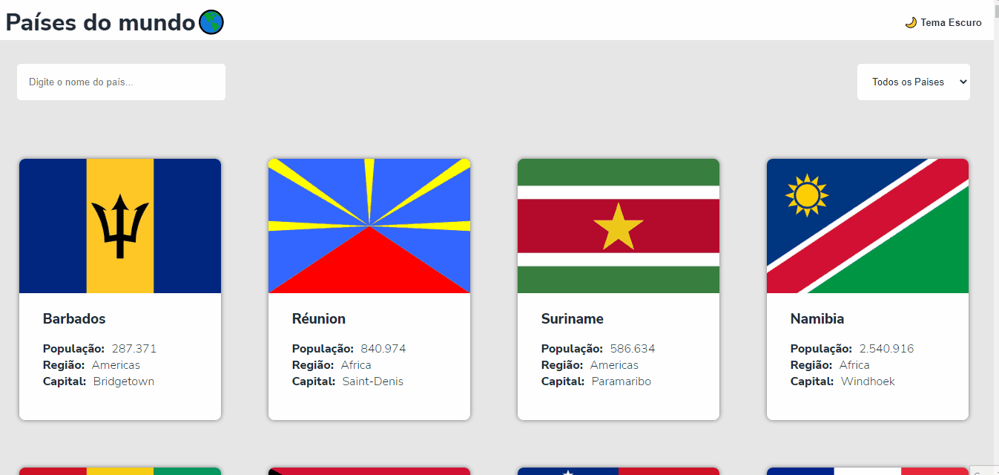

## 🧾 Descrição

O projeto API-paises(Restcountries API) é uma API REST desenvolvida em Node.js que fornece informações sobre países do mundo. A API oferece rotas para obter dados como nome, bandeira, capital, idioma, moeda, código de discagem, população, entre outros. Esses dados são obtidos através da integração com a API pública do site "restcountries.com". Coloquei a opção de tema Dark-Light.

<h1>

## 🔌 Tecnologias utilizadas

- **HTML:** linguagem de marcação usada para estruturar e apresentar o conteúdo da página;
- **JavaScript:** Linguagem de programação que permite criar interações dinâmicas na web. Com ela é possível manipular o conteúdo HTML e CSS em tempo real, validar formulários, criar animações, entre outras possibilidades.
- **API RestCountries:** API pública que fornece informações sobre países do mundo. É uma fonte de dados de código aberto que pode ser acessada por desenvolvedores de software para obter informações detalhadas sobre países, como nome, bandeira, capital, idioma, moeda, código de discagem, população, entre outros.
- **React:** biblioteca JavaScript para construção de interfaces de usuário
- **Axios:** biblioteca para fazer requisições HTTP
- **React Router DOM:** biblioteca para gerenciamento de rotas no React
- **Material-UI:** biblioteca de componentes de interface de usuário para React baseada no Material Design da Google
- **Styled Components:** biblioteca para estilização de componentes React com CSS-in-JS
- **Emotion:** biblioteca para estilização de componentes React com CSS-in-JS
- **React Icons:** biblioteca de ícones para React
- **React Ionicons:** biblioteca de ícones vetoriais para React
- **Testing Library:** conjunto de bibliotecas para testes unitários e de integração em React
- **Eslint:** ferramenta de análise de código JavaScript para identificação de problemas de sintaxe e estilo de código
- **Web Vitals:** biblioteca para medição de métricas de desempenho em aplicações web

## ⚙️ Estrutura

- **img:** Contém imagens utilizadas no projeto e para apresentação no Readme.md;
- **public:** Contém a linguagem de marcação(index.html) usada para estruturar e apresentar o conteúdo da página;
- **src:** Contém todo o código-fonte da aplicação, incluindo componentes, arquivos de estilização, imagens e outros recursos necessários.

## 🏳️ Como executar?

### **Passo 1**
Faça download do repositório

### **Passo 2**
Execute o comando ```npm install``` para instalar as dependências do projeto;

### **Passo 3**
Após a instalação das dependências, execute o comando ```npm start```;

### **Passo 4**
Aguarde o processo de compilação e será aberto no navegador no endereço http://localhost:3000.

<br>

## ✅ Resultado (Preview)

### **API Países**


<br>

## 💻 Autor: Luan Ferreira

Portfólio:
- [Github](https://github.com/fluanbrito)

Contato:
- [Linkedin](https://www.linkedin.com/in/luanferreirab/)

<h1>

## 🚀 Sobre mim
Sou um grande entusiasta e apaixonado por tecnologia, empreendedorismo e inovação. Hoje, estou a cursar o curso de Sistema de Informação pelo Instituto Federal, faço uso profissionalmente de ferramentas e me aprofundo em temas como Marketing, Machine Learning AWS, Metodologias ágeis, Gestão de Projetos, Programação Web, Administração de Sistemas, Redes de computadores, entre outros.
